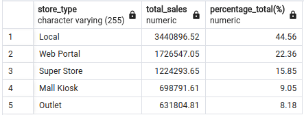

# Multinational Retail Data Centralization Project

<div align="center">
	<table>
		<tr>
			<td><code></code></td>
			<td><code></code></td>
			<td><code></code></td>
			<td><code></code></td>
			<td><code></code></td>
			<td><code></code></td>
			<td><code></code></td>
		</tr>
	</table>
</div>

---

This work for a multinational company that sells various goods across the globe.

Currently, their sales data is spread across many different data sources making it not easily accessible or analysable by current members of the team.

In an effort to become more data-driven, the organisation would like to make its sales data accessible from one centralised location.

The first goal will be to produce a system that stores the current company data in a database so that it's accessed from one centralised location and acts as a single source of truth for sales data.

## Table of Contents

1. [Description](#description)
    - [Milestone 1](#milestone-1)
    - [Milestone 2](#milestone-2)
    - [Milestone 3](#milestone-3)
    - [Milestone 4](#milestone-4)
2. [Tools used](#tools-used)
3. [Installation](#installation)
4. [How to use](#how-to-use)
5. [File structure](#file-structure)
6. [Licence](#licence)

## Description

The project is to develop a system - data pipeline - that extracts information from various sources including API requests, AWS S3 and AWS database. After extraction, the data needs to be cleaned and uploded to a centralized database - in this case a local postgresql database - where later an analysis can be performed on the data to gain valuable insights and make recommendations.

The code first inspects the local database, searching the existence of the database and creates it if doesn't exist and also creates the required schema for the data. If the database exists at the first place it still performs a check on the existence of the tables and creates the ones that are not present. After this the code starts to request information from a remote source to query the database. Upon confirming the required table to extract it performs the extraction, saving and cleaning of the data then it uploads it to a local database.

The extraction of further data continues with extracting information from a pdf file, downloading data via an API request, AWS S3 bucket, AWS dtabase again and finally it performs an other API request to download clean and to upload the data into the local database.

The script then reads the content of the database folder where raw queries are stored for the project and executes them. The first queries are altering the data types and adding primary and foreign keys. When this is done, the execution of the rest of the queries performed to answer business questions that stored in a csv file and also printed to the terminal.

### Milestone 1

The first milestone is the setup of the github repository.


### Milestone 2

The construction of the core code files including database communication related, data cleaning, data extraction and credential reader python files.
The pipeline depicts the ETL process where data is being extracted, transformed and loaded into the final destination.

DataExtractor class is responsible for the data acquisition from several data sources.

The first data source is extracted from an AWS Relational Database,


with a secure connection from the DatabaseConnector class that is responsible handling all database related connections and queries.


The connection to AWS described as follows:


The data is being cleaned before uploded into a local postgresql database.

The data ingestion continues until all the sources has been extracted, including extraction from AWS S3 objects, via API requests and from AWS RDS. The files are being cleaned before loaded into the database.

This section of the project also encompassed the establishment of the local database and the creation of relevant tables to store the project's data.
The created tables will be altered later to for the correct data type.

### Milestone 3

The following picture depicts the database schema that has been created for the project.


After setting up the star-based databse schema queries has been executed to alter the table columns data type, cleaning the data where necessary and creating new columns from the existing data.

```sql
UPDATE dim_products
SET product_price = TRIM(LEADING '£' FROM product_price);

ALTER TABLE dim_products
ADD weight_class VARCHAR(50);

UPDATE dim_products as dm
SET weight_class = (CASE WHEN dm.weight < 2 THEN 'Light'
                         WHEN dm.weight >= 2 AND dm.weight < 40 THEN 'Mid_Sized'
                         WHEN dm.weight >= 40 AND dm.weight < 140 THEN 'Heavy'
                         WHEN dm.weight >= 140 THEN 'Truck_Required'
   END);

ALTER TABLE dim_products
RENAME removed TO still_available;

ALTER TABLE dim_products
    ALTER COLUMN product_price TYPE FLOAT USING product_price::double precision,
    ALTER COLUMN weight TYPE FLOAT USING weight::double precision,
    ALTER COLUMN "EAN" TYPE VARCHAR(50),
    ALTER COLUMN product_code TYPE VARCHAR(50),
    ALTER COLUMN date_added TYPE DATE,
    ALTER COLUMN uuid TYPE UUID USING uuid::uuid,
    ALTER COLUMN still_available TYPE BOOLEAN USING CASE WHEN still_available = 'Still_avaliable' THEN TRUE ELSE FALSE END,
    ALTER COLUMN weight_class TYPE VARCHAR(50);
```

This section also contains the addition of Primary and Foreign Keys to tables.

```sql
ALTER TABLE orders_table 
    ADD CONSTRAINT constraint_fk_date_times 
    FOREIGN KEY (date_uuid)
        REFERENCES dim_date_times (date_uuid);
```

### Milestone 4

Utilizing SQL queries to extract information from the data and answer business questions. By performing SQL queries on the data we answer the following questions:

- How many stores the business have and in which countries?


- Which locations currently have the most stores?


- Which months produced the largest amount of sales?


- How many sales are coming from online?


- What percentage of sales come through each type of store?



- Which month in each year produced the highest cost of sales?


- What is out staff headcount?


- Which German store type is selling the most?


- How quickly is the company making sales?


## Tools used

- [postgreSQL](https://www.postgresql.org/) - PostgreSQL is a powerful, open source object-relational database system

- [pgAdmin](https://www.pgadmin.org/) - pgAdmin is a feature rich Open Source administration and development platform for PostgreSQL

- [Amazon Relational Database Service (Amazon RDS)](https://aws.amazon.com/rds/) - Relational Database in the cloud

- [Amazon API Gateway](https://aws.amazon.com/api-gateway/) - Amazon API Gateway is a fully managed service that makes it easy for developers to create, publish, maintain, monitor, and secure APIs at any scale. APIs act as the "front door" for applications to access data, business logic, or functionality from your backend services.

- [Amazon Simple Storage Service (Amazon S3)](https://aws.amazon.com/s3/) - It's an object storage service provides unparalleled scalability, data availability, security, and performance. It caters to customers of various sizes and industries, enabling them to securely store and safeguard any volume of data for a wide range of purposes. Whether it's data lakes, cloud-native applications, or mobile apps.

## Installation

Follow the steps to start the pipeline process:

1. Clone the github repository by typig in the Command Line Interface ```git clone  [git_repository_url]``` on either operating system.
2. Navigate to the folder where the repository was cloned and in the source folder open a terminal/shell or alternatively navigate to the folder using the shell.
3. Set up the environment using Anaconda (recommended) by typing in the CLI or shell ```conda env create -f environment.yml```. This will create the environment with the required python libraries for the project.
4. Type the command ```python3 start_data_pipeline.py```.

## How to use

The script will automatically download, clean and upload data to the database and executes the queries that is saved locally and ready for analysis.
The data upload to the local database is set to append by default rather then replace. If the data already exists in the database it will not overwrite it if there are constraint present.

## File structure

The files for the project can be found in the multinational-retail-data-centralisation247 folder.

```txt
.
├── creds
│   ├── credentials.yaml
│   └── dummy_credentials.yaml
├── database
│   ├── alter_tables
│   │   ├── alter_dim_card_details.sql
│   │   ├── alter_dim_date_times.sql
│   │   ├── alter_dim_products.sql
│   │   ├── alter_dim_store_details.sql
│   │   ├── alter_dim_users.sql
│   │   ├── alter_orders_table.sql
│   │   ├── alter_tables_foreign_key.sql
│   │   └── alter_tables_primary_key.sql
│   ├── create_tables
│   │   ├── create_db.sql
│   │   ├── create_dim_card_details.sql
│   │   ├── create_dim_date_times.sql
│   │   ├── create_dim_products.sql
│   │   ├── create_dim_store_details.sql
│   │   ├── create_dim_users.sql
│   │   └── create_orders_table.sql
│   ├── query_results
│   │   ├── select_query_1.csv
│   │   ├── select_query_2.csv
│   │   ├── select_query_3.csv
│   │   ├── select_query_4.csv
│   │   ├── select_query_5.csv
│   │   ├── select_query_6.csv
│   │   ├── select_query_7.csv
│   │   ├── select_query_8.csv
│   │   └── select_query_9.csv
│   └── select_query
│       ├── select_query_1.sql
│       ├── select_query_2.sql
│       ├── select_query_3.sql
│       ├── select_query_4.sql
│       ├── select_query_5.sql
│       ├── select_query_6.sql
│       ├── select_query_7.sql
│       ├── select_query_8.sql
│       └── select_query_9.sql
├── data_files
│   ├── legacy_users.csv
│   ├── orders_table.csv
│   ├── products.csv
│   ├── sale_date.csv
│   ├── stores.csv
│   └── user_card_data.csv
├── environment.yml
├── images
│   ├── aws_rds.png
│   ├── git_repo.png
│   ├── init_db.png
│   ├── q1.png
│   ├── q2.png
│   ├── q3.png
│   ├── q4.png
│   ├── q5.png
│   ├── q6.png
│   ├── q7.png
│   ├── q8.png
│   ├── q9.png
│   └── star_schema.png
├── Licence.txt
├── README.md
└── source
    ├── cred_reader.py
    ├── database_utils.py
    ├── data_cleaning.py
    ├── data_extraction.py
    ├── decorator_class.py
    ├── __pycache__
    │   ├── cred_reader.cpython-311.pyc
    │   ├── database_utils.cpython-311.pyc
    │   ├── data_cleaning.cpython-311.pyc
    │   ├── data_extraction.cpython-311.pyc
    │   ├── decorator_class.cpython-311.pyc
    │   └── extractors.cpython-311.pyc
    └── start_data_pipeline.py
```

## Licence

CC0 1.0 Universal - see `Licence.txt`
